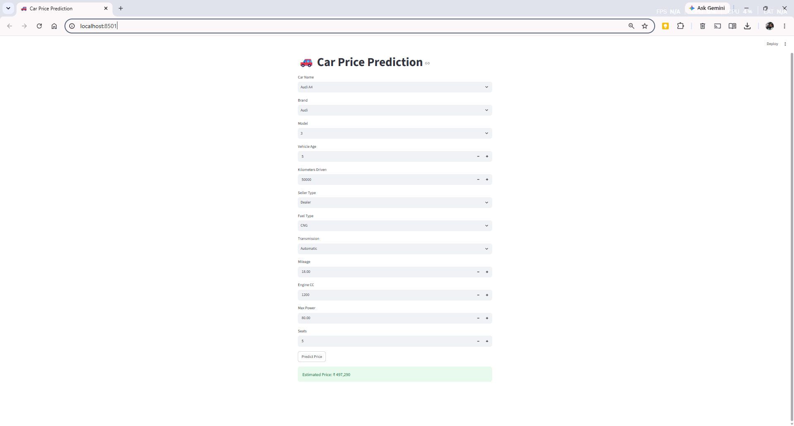

# 🚗 Car Price Prediction Web App

## Participant Details

- **Name:** Anandan M A
- **MUID:** anandanma@mulearn

---

## Project Overview

This project predicts the selling price of a used car using a Machine Learning model trained on the CarDekho Used Car Dataset. The application is built with Streamlit and enables users to enter vehicle details and receive an estimated selling price instantly.

---

## Dataset

- CarDekho Used Car Dataset

---

## Machine Learning Model

- Random Forest Regressor

---

## Features Used

- Car Name
- Brand
- Model
- Vehicle Age
- Kilometers Driven
- Seller Type
- Fuel Type
- Transmission Type
- Mileage
- Engine CC
- Max Power
- Seats

---

## Technologies Used

- Python
- Pandas
- NumPy
- Scikit-learn
- Joblib
- Streamlit
- Matplotlib
- Seaborn

---

## Project Structure

```text
Day09/
│── app.py
│── requirements.txt
│── README.md
│── data/
│   └── cardekho_dataset.csv
│── model/
│   ├── model.pkl
│   └── encoders.pkl
│── notebooks/
│   └── car_price_prediction.ipynb
│── images/
│   └── app_screenshot.png   (optional)
```

---

## Installation

```bash
pip install -r requirements.txt
```

## Run the Application

```bash
streamlit run app.py
```

---

## Deployment Approach

The trained Random Forest model and Label Encoders are serialized using Joblib. The Streamlit application loads these files and performs real-time predictions based on user input.

---

## Challenges Faced

- Encoding categorical features
- Saving and loading Label Encoders
- Resolving feature mismatch between training and prediction
- Synchronizing encoders with the trained model

---

## Future Improvements

- Improved user interface
- Display car images
- Feature importance visualization
- Prediction history
- Cloud deployment

---

## Output

The application predicts the estimated selling price based on the vehicle details entered by the user.

### Sample Output

Estimated Price: ₹497,290


## Application Screenshot

